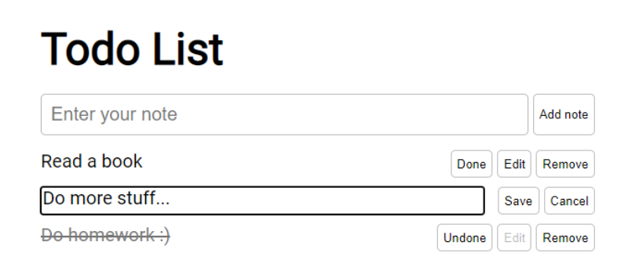

# Hillel IT School homework

A TODO List that works with the API https://todo.hillel.it/ 
with login by email.
Tasks can be added, deleted, edited and marked as finished.

For authorization, you can use absolutely any mail, even not real.

## Сheck it out
https://kostya-x.github.io/todo/

## More projects here
https://kostya-x.github.io/projects.html

## For development:
1. You need to install Node.js from https://nodejs.org
2. Copy all files from this repo to your project
3. In terminal - npm install
4. Write your code in src/index.js
5. Enjoy!
